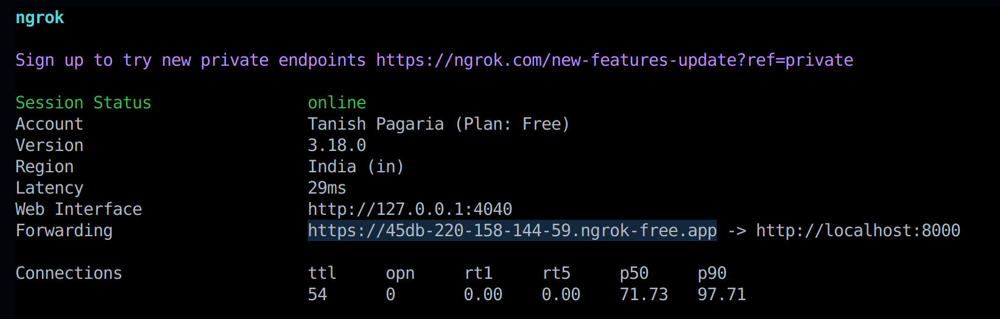
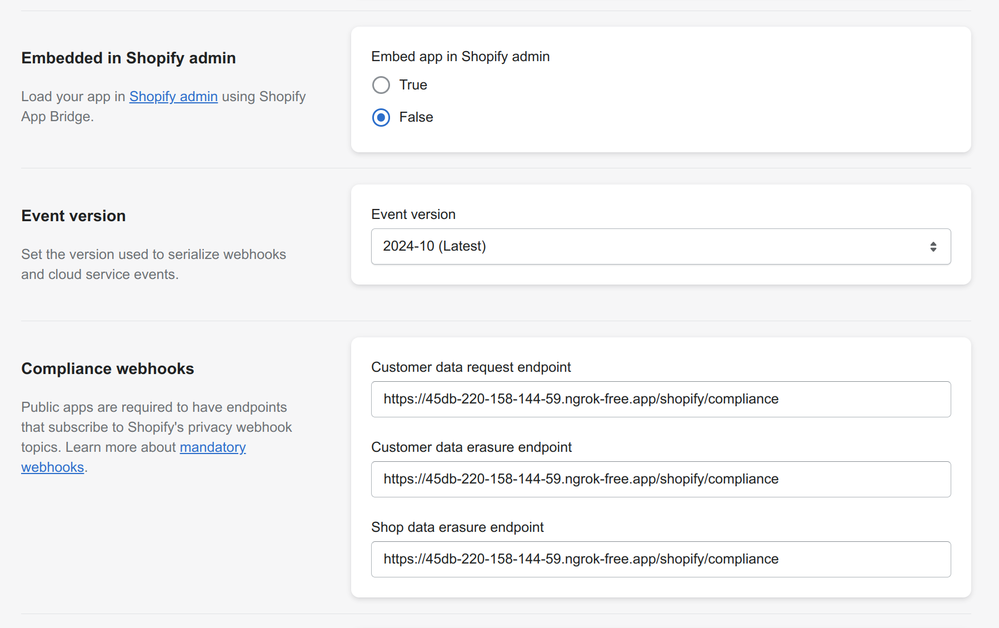
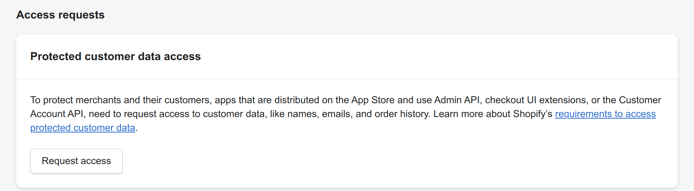
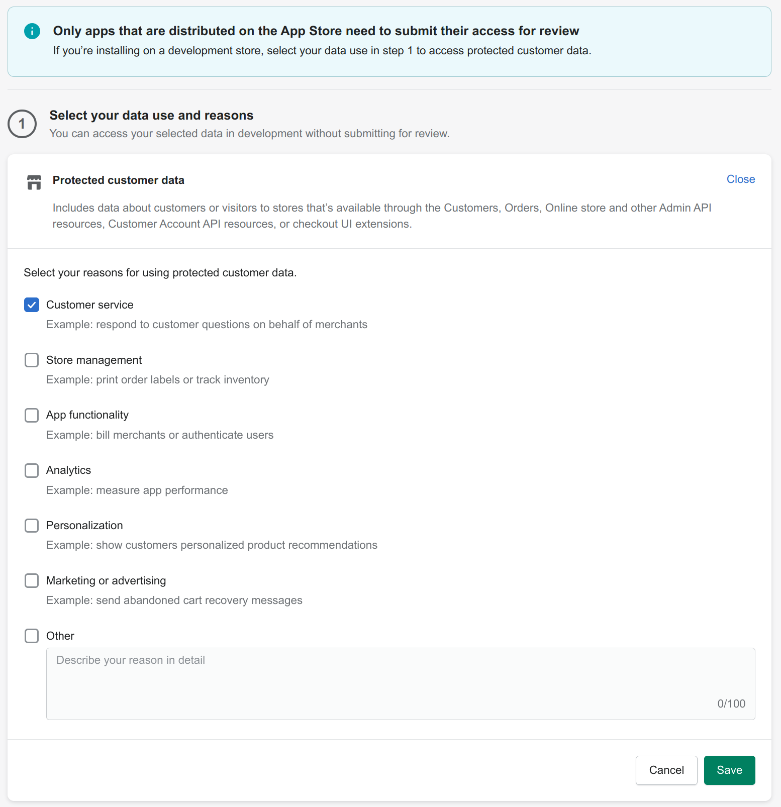
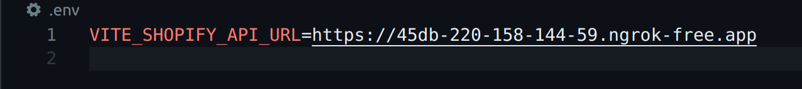
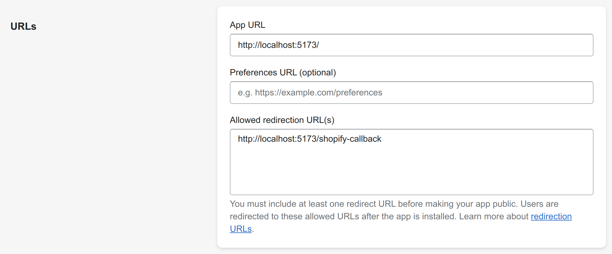

# Shopify Dummy

## Setup (Local Machine)

### Prerequisites
- [Git](https://git-scm.com/downloads)
- [Python 3.x](https://www.python.org/downloads/) (created with Python 3.11.10)
- [Docker](https://docs.docker.com/engine/install/) and [Docker Compose](https://docs.docker.com/compose/install/) **OR** [PostgreSQL](https://www.postgresql.org/download/) (if not using Docker)
- [Node.js](https://nodejs.org/en/download/package-manager)
- [ngrok](https://ngrok.com/download)

### Creating a Shopify app
1.  Sign in to your **Shopify Partners Account** at https://www.shopify.com/partners or create one if not already created.

2.  In order to create a new app, navigate to `Apps` section on the dashboard and click `Create App` button or simply navigate to https://partners.shopify.com/current/apps/new.

3.  Select `Create app manually` and fill in the required name for the app and click `Create` button.

*The remaining app configuration will be covered along with the backend and frontend setup.*

### Steps
1.  Clone the repositories on your local machine:
    ```sh
    git clone https://github.com/yorozuya-2003/shopify-dummy-backend.git
    git clone https://github.com/yorozuya-2003/shopify-dummy-frontend.git
    ```

2.  **Setting up backend**:
    *   Navigate to the backend directory:
        ```sh
        cd shopify-dummy-backend
        ```
    
    *   Create a virtual environment (optional but recommended):
        ```sh
        python3 -m venv venv
        source venv/bin/activate  # for Linux/macOS
        venv\Scripts\activate     # for Windows
        ```

    *   Install dependencies:
        ```sh
        pip install -r requirements.txt
        ```
    
    *   Set up environment variables (create a .env file in the same directory based on .env.example):
        ```sh
        cd backend
        ```
        ```sh
        cp .env.example .env
        ```
    
    *   Add the Client ID, Client secret and the desired [access scopes](https://shopify.dev/docs/api/usage/access-scopes) of the created Shopify app in the .env file.
        
        ```
        SHOPIFY_API_KEY=<app-client-id>
        SHOPIFY_API_SECRET=<app-client-secret>
        SHOPIFY_API_SCOPES=<app-access-scopes>
        ```

    *   **Set up the database**:  
        If using Docker, you can use docker-compose to setup the database. Otherwise, ensure PostgreSQL is installed and accessible.
        ```sh
        docker compose up -d
        ```

    *   Apply database migrations:
        ```sh
        python3 manage.py migrate
        ```

    *   Run the server:
        ```sh
        python3 manage.py runserver
        ```
        The server runs at http://localhost:8000.

    *   Set up ngrok through on your machine via [the quick guide](https://ngrok.com/docs/getting-started/). Start ngrok on port 8000:
        ```sh
        ngrok http 8000
        ```
        Use the forwarding URL generated by ngrok to configure the settings in the Shopify app previously created.
        

    *   Configure the following settings in the `Configuration` section of the Shopify app *(similar to the example image shown below)*. Use ngrok forwarding URL to fill in compliance webhooks as `https://<ngrok-url>/shopify/compliance`:
        
        *Reference: https://shopify.dev/docs/apps/build/privacy-law-compliance*

    *   Request access for `Protected customer data access` in the `API access` section of the Shopify app by clicking the `Request access` button:
        
        
        Select any option in the step-1 of the access request page and save *(there is no need for completing step-2 for test use case)*:
        

        *Reference: https://shopify.dev/docs/apps/launch/protected-customer-data*

3.  **Setting up frontend**:
    *   Navigate to the frontend directory:
        ```sh
        cd shopify-dummy-frontend
        ```

    *   Install dependencies:
        ```sh
        npm i
        ```

    *   Set up environment variables (create a .env file in the same directory based on .env.example):
        ```sh
        cp .env.example .env
        ```

        Use the ngrok forwarding URL to fill up the .env file *(similar to the example image shown below)*:
        ```
        SHOPIFY_API_URL=<ngrok-forwarding-url>
        ```
        

    *   Start the frontend:
        ```sh
        npm run dev
        ```
        The frontend runs at http://localhost:5173.

    *   Configure the `Configuration` settings in Shopify app as shown in the image below:
        

        Save the app settings.


### Using the app
*   Use any test store in your Shopify Partners account to install the app by visiting http://localhost:5173 and entering the shop domain in the format: `example.myshopify.com`.

*   Try adding products and creating orders to check if the app is working correctly and loading the data.
*   In order to access django admin panel for accessing the database:
    *   Navigate to the django project directory:
        ```sh
        cd shopify-dummy-backend/backend
        ```

    *   Create an admin account by entering desired username and password:
        ```
        python3 manage.py createsuperuser
        ```
        Use these credentials to access the admin panel at http://localhost:8000/shopify/admin/.
