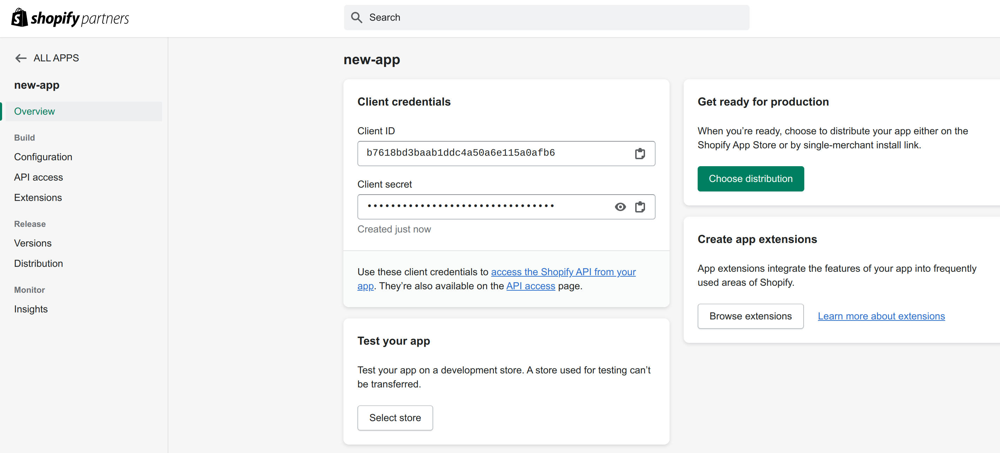

# Shopify Application

## Setup (Local Machine)

### Prerequisites
- [Git](https://git-scm.com/downloads)
- [Python 3.x](https://www.python.org/downloads/) (created with Python 3.11.10)
- [Docker](https://docs.docker.com/engine/install/) and [Docker Compose](https://docs.docker.com/compose/install/) **OR** [PostgreSQL](https://www.postgresql.org/download/) (if not using Docker)
- [Node.js](https://nodejs.org/en/download/package-manager)
- [ngrok](https://ngrok.com/download)

### Creating a Shopify app
1.  Sign in to your **Shopify Partners Account** at https://www.shopify.com/partners or create one if not already created.

2.  In order to create a new app, navigate to `Apps` section on the dashboard and click `Create App` button or simply navigate to https://partners.shopify.com/current/apps/new.

3.  Select `Create app manually` and fill in the required name for the app and click `Create` button.

*The remaining app configuration will be covered along with the backend and frontend setup.*

### Instructions
1.  Clone the repositories on your local machine:
    ```sh
    git clone https://github.com/yorozuya-2003/shopify-backend.git
    git clone https://github.com/yorozuya-2003/shopify-frontend.git
    ```

2.  **Setting up backend**:
    *   Navigate to the backend directory:
        ```sh
        cd shopify-backend
        ```
    
    *   Create a virtual environment (optional but recommended):
        ```sh
        python3 -m venv venv
        source venv/bin/activate  # for Linux/macOS
        venv\Scripts\activate     # for Windows
        ```

    *   Install dependencies:
        ```sh
        pip install -r requirements.txt
        ```
    
    *   Set up environment variables (create a .env file in the same directory based on .env.example):
        ```sh
        cd backend
        ```
        ```sh
        cp .env.example .env
        ```
    
    *   Add the Client ID, Client secret and the desired [access scopes](https://shopify.dev/docs/api/usage/access-scopes) of the created Shopify app in the .env file.
        
        ```sh
        SHOPIFY_API_KEY=<app-client-id>
        SHOPIFY_API_SECRET=<app-client-secret>
        SHOPIFY_API_SCOPES=<app-access-scopes>
        ```

    *   **Set up the database**:  
        If using Docker, you can use docker-compose to setup the database. Otherwise, ensure PostgreSQL is installed and accessible.
        ```sh
        docker compose up -d
        ```

    *   Apply database migrations:
        ```sh
        python3 manage.py migrate
        ```

    *   Run the server:
        ```sh
        python3 manage.py runserver
        ```
        The server runs at http://localhost:8000.

    *   Set up ngrok through on your machine via [the quick guide](https://ngrok.com/docs/getting-started/). Start ngrok on port 8000:
        ```sh
        ngrok http 8000
        ```
        Use the forwarding URL generated by ngrok to configure the settings in the Shopify app previously created.
        

    *   Update the backend URL in the .env:
        ```sh
        SHOPIFY_API_URL=<ngrok-forwarding-url>
        ```
    
    *   Configure the following settings in the `Configuration` section of the Shopify app *(similar to the example image shown below)*. Use ngrok forwarding URL to fill in compliance webhooks as `https://<ngrok-forwarding-url>/shopify/compliance`:
        
        *Reference: https://shopify.dev/docs/apps/build/privacy-law-compliance*

    *   Request access for `Protected customer data access` in the `API access` section of the Shopify app by clicking the `Request access` button:
        
        
        Select any option in the step-1 of the access request page and save *(there is no need for completing step-2 for test use case)*:
        

        *Reference: https://shopify.dev/docs/apps/launch/protected-customer-data*

3.  **Setting up frontend**:
    *   Navigate to the frontend directory:
        ```sh
        cd shopify-frontend
        ```

    *   Install dependencies:
        ```sh
        npm i
        ```

    *   Set up environment variables (create a .env file in the same directory based on .env.example):
        ```sh
        cp .env.example .env
        ```

        Use the ngrok forwarding URL to fill up the .env file *(similar to the example image shown below)*:
        ```sh
        VITE_SHOPIFY_API_URL=<ngrok-forwarding-url>
        ```
        

    *   Start the frontend:
        ```sh
        npm run dev
        ```
        The frontend runs at http://localhost:5173.
    

    *   Add the frontend url to the .env in the backend directory as well:
        ```sh
        SHOPIFY_APP_URL=http://localhost:5173
        ```

    *   Configure the `Configuration` settings in Shopify app as shown in the image below:
        

        Save the app settings.


### Using the app
*   Use any test store in your Shopify Partners account to install the app by visiting http://localhost:5173 and entering the shop domain in the format: `example.myshopify.com`.

*   Try adding products and creating orders to check if the app is working correctly and loading the data.
*   In order to access django admin panel for accessing the database:
    *   Navigate to the django project directory:
        ```sh
        cd shopify-backend/backend
        ```

    *   Create an admin account by entering desired username and password:
        ```
        python3 manage.py createsuperuser
        ```
        Use these credentials to access the admin panel at http://localhost:8000/shopify/admin/.

## Deployment
### Backend (EC2 instance with RDS instance)
***Note**: The instructions below are for **Amazon Linux** operating system instance.*

### Instructions for setting up the project
1. Connect to the instance using terminal on your local machine via SSH using the location of the private key (`.pem` file), the username (`ec2-user` in this case) and the public DNS or IP address:
    ```sh
    sudo ssh -i /path/key-pair-name.pem ec2-user@instance-public-dns-address
    ```

2. Install git on the instance:
    ```sh
    sudo yum update -y
    ```
    ```sh
    sudo yum install git -y
    ```
    ```sh
    git --version
    ```

4. Install Python3.x on the instance *(check the Python versions [here](https://www.python.org/downloads/) in case of any change)*:
    ```sh
    sudo yum install gcc openssl-devel bzip2-devel libffi-devel zlib-devel -y
    ```
    ```sh
    wget https://www.python.org/ftp/python/3.11.10/Python-3.11.10.tgz
    ```
    ```sh
    tar xzf Python-3.11.10.tgz
    ```
    ```sh
    cd Python-3.11.10
    ```
    ```sh
    sudo ./configure --enable-optimizations
    ```
    ```sh
    sudo make altinstall
    ```
    ```sh
    sudo rm -f ../Python-3.11.10.tgz
    ```

5. Create a directory for base solution projects *(optional as per requirements)*:
    ```sh
    # if need to move to root directory
    cd ~
    ```
    ```sh
    mkdir shopify
    ```
    ```sh
    cd shopify
    ```

6. Clone the backend repository:
    ```sh
    git clone https://github.com/yorozuya-2003/shopify-backend.git
    ```

7.  Navigate to the backend directory:
    ```sh
    cd shopify-backend
    ```

8.  Create a virtual environment:
    ```sh
    python3.11 -m venv venv
    source venv/bin/activate
    ```

9.  Install dependencies:
    ```sh
    pip install -r requirements.txt
    ```

10. Set up environment variables (create a .env file in the same directory based on .env.example):
    ```sh
    cp .env.example .env
    ```

11. Add the Client ID, Client secret and the desired [access scopes](https://shopify.dev/docs/api/usage/access-scopes) of the created Shopify app in the .env file.
    ```sh
    nano .env
    ```
    ```sh
    SHOPIFY_API_KEY=<app-client-id>
    SHOPIFY_API_SECRET=<app-client-secret>
    SHOPIFY_API_SCOPES=<app-access-scopes>
    ```

12. Add AWS RDS configurations to the .env file:
    ```
    # rds postgresql config
    DB_NAME=
    DB_HOST=
    DB_SECRET_NAME=
    DB_REGION=
    DB_PORT=

    # aws secret manager config
    AWS_ACCESS_KEY_ID=
    AWS_SECRET_ACCESS_KEY=
    AWS_SESSION_TOKEN=
    ```

13. Make changes to Django settings in order to connect to RDS and allow requests from other hosts:
    ```sh
    nano backend/settings.py
    ```

    Edit the file to make the following changes:
    ```python
    USE_AWS_RDS = True
    ```

14. Apply database migrations:
    ```sh
    python3.11 manage.py migrate
    ```

15. Test by running the server:
    ```sh
    python3.11 manage.py runserver
    ```
    Use Ctrl + C to stop the server.

16. Install Gunicorn:
    ```sh
    pip install gunicorn
    ```
    Test your application with Gunicorn:
    ```sh
    gunicorn --bind 0.0.0.0:8000 backend.wsgi:application
    ```
    Use Ctrl + C to stop the server.


### Instructions for configuring EC2 instance settings to access the application from local machine
Make sure your EC2 instance's security group is configured to allow inbound traffic on port 80 (HTTP).  
To check and configure this:
1.  Go to the EC2 Dashboard in the AWS Management Console.

2.  Select your instance and scroll down to the Security groups section.

3.  Click on the security group linked to your instance.

4.  In the Inbound rules tab, ensure there is a rule that allows traffic on port 80 and port 443:  
    **Type**: HTTP  
    **Protocol**: TCP  
    **Port Range**: 80  
    **Source**: 0.0.0.0/0

    **Type**: HTTPS  
    **Protocol**: TCP  
    **Port Range**: 443  
    **Source**: 0.0.0.0/0    

5.  Ensure that you have a **domain name** configured with the instance.


### Instructions for configuring Nginx and Gunicorn (for deployment)
1.  Install and start Nginx on the instance:
    ```sh
    sudo yum install nginx -y
    ```
    ```sh
    sudo systemctl start nginx
    ```
    ```sh
    sudo systemctl status nginx
    ```
    The service should be active.  
    **To ensure that everything is set up correctly, go to your domain name associated with the EC2 instance on the browser on your local machine. The Nginx webpage should be visible.**

2.  **Configure Gunicorn on the instance:**  
    Create a systemd service file for Gunicorn, pointing it to your Django project directory.
    ```sh
    sudo nano /etc/systemd/system/gunicorn.service
    ```
    Add the following content to the file and save it *(adjust paths as per requirement)*.
    ```ini
    [Unit]
    Description=gunicorn daemon
    After=network.target

    [Service]
    User=ec2-user
    Group=nginx
    WorkingDirectory=/home/ec2-user/shopify/shopify-backend/backend
    ExecStart=/home/ec2-user/shopify/shopify-backend/venv/bin/gunicorn \
            --access-logfile - \
            --workers 3 \
            --bind unix:/home/ec2-user/shopify/shopify-backend/backend.sock \
            backend.wsgi:application

    [Install]
    WantedBy=multi-user.target
    ```
    Reload the systemd manager configuration, start the Gunicorn service, and enable it to start on boot:
    ```sh
    sudo systemctl daemon-reload
    ```
    ```sh
    sudo systemctl start gunicorn
    ```
    ```sh
    sudo systemctl enable gunicorn
    ```

3.  **Configure Nginx to act as a reverse proxy for Gunicorn**:  
    Edit the Nginx configuration:
    ```sh
    sudo nano /etc/nginx/nginx.conf
    ```
    Add the following block inside the http {} section (replace `yourdomain.com` with your domain):
    ```nginx
    server {
        listen 80;
        server_name yourdomain.com;

        location /shopify/static/ {
            alias /home/ec2-user/shopify/shopify-backend/backend/static/;
        }

        location /shopify/ {
            proxy_pass http://unix:/home/ec2-user/shopify/shopify-backend/backend.sock;
            proxy_set_header Host $host;
            proxy_set_header X-Real-IP $remote_addr;
            proxy_set_header X-Forwarded-For $proxy_add_x_forwarded_for;
            proxy_set_header X-Forwarded-Proto $scheme;
        }
    }
    ```
    Check for any syntax errors:
    ```sh
    sudo nginx -t
    ```
    Restart Nginx:
    ```sh
    sudo systemctl restart nginx
    ```

### Instructions for fixing Nginx connection issue
Check Nginx error logs:
```sh
sudo tail -f /var/log/nginx/error.log
```

If you encounter this issue: `nginx connet to .sock failed (13:Permission denied) - 502 bad gateway`, follow the steps below to fix it *([forum link](https://forum.nginx.org/read.php?11,290332) for reference)*

1.  Change the default user in the very top section of the nginx.conf file to your username (`ec2-user` in this case):
    ```sh
    sudo nano /etc/nginx/nginx.conf
    ```
    Replace the default user in the file from `user nginx;` to `user ec2-user`.

2.  Toggle the SELinux boolean value for httpd network connect to on, with the persistant flag:
    ```sh
    sudo setsebool httpd_can_network_connect on -P
    ```

3.  If the issue persists after restarting Nginx and Gunicorn, recommended steps in fixing SELinux *(as per the forum)*:
    ```sh
    sudo cat /var/log/audit/audit.log | grep nginx | grep denied | audit2allow -M mynginx
    ```
    ```sh
    sudo semodule -i mynginx.pp
    ```

4.  Restart Nginx and Gunicorn services:
    ```sh
    sudo systemctl restart gunicorn
    ```
    ```sh
    sudo systemctl restart nginx
    ```

### Setting up self-signed certificate via Let's Encrypt
1.  Ensure that your Django app is accessible via HTTP on your domain after completing the previous steps.

2.  Install Certbot:
    ```sh
    sudo yum install certbot-nginx
    ```

3.  Run Certbot to generate and install the SSL certificate automatically:
    ```sh
    sudo certbot --nginx -d yourdomain.com -d www.yourdomain.com
    ```

4.  Verify by accessing your domain in a browser (https://yourdomain.com). You should now see a secure connection.

5.  You can test the certificate renewal process with:
    ```sh
    sudo certbot renew --dry-run
    ```

6.  Restart Nginx and Gunicorn services:
    ```sh
    sudo systemctl restart gunicorn
    ```
    ```sh
    sudo systemctl restart nginx
    ```

### Configuring backend with the Shopify app:
1.  Update the backend URL in the .env:
    ```sh
    SHOPIFY_API_URL=<your-domain-url>
    ```

2.  Configure the following settings in the `Configuration` section of the Shopify app *(similar to the example image shown below)*. Use your domain URL to fill in compliance webhooks as `https://<your-domain-url>/shopify/compliance`:

*Reference: https://shopify.dev/docs/apps/build/privacy-law-compliance*

3.  Request access for `Protected customer data access` in the `API access` section of the Shopify app by clicking the `Request access` button:
        
    Select any option in the step-1 of the access request page and save *(there is no need for completing step-2 for test use case)*:
    
    *Reference: https://shopify.dev/docs/apps/launch/protected-customer-data*


### Frontend (Vercel)
The frontend can be easily deployed on [Vercel](https://vercel.com/) via GitHub.  
*Reference: https://vercel.com/docs/frameworks/vite*
1.  Add the backend domain URL to the environment variables on your deployed Vercel application:
    ```sh
    VITE_SHOPIFY_API_URL=<your-domain-url>
    ```

2.  Add the deployed Vercel frontend URL to the .env in backend directory:
    ```sh
    SHOPIFY_APP_URL=<vercel-frontend-url>
    ```
